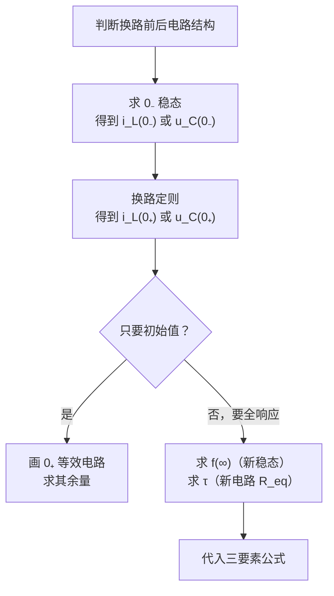

# 一阶 RL / RC 电路暂态分析

> 适用题型：电路中含**一个**储能元件（电感或电容），在 $t=0$ 发生换路（开关动作），求初始值、时间常数或全响应。

## 目录

- [一、换路定则](#一换路定则最基础必背)
- [二、求 0+ 时刻各量](#二求-t0-时刻各量)
- [三、时间常数 τ](#三时间常数-τ)
- [四、三要素法](#四三要素法求全响应最重要)
- [五、解题顺序总结](#五解题顺序总结)
- [示例](#示例求-i_l0)

---

## 一、换路定则（最基础，必背）

> [!IMPORTANT]
> $$i_L(0_+) = i_L(0_-) \qquad u_C(0_+) = u_C(0_-)$$
> 电感电流、电容电压不能突变。

**原理**：电感电压 $u_L = L\dfrac{di_L}{dt}$ ，若 $i_L$ 突变则 $u_L \to \infty$ ，不合理；电容同理： $i_C = C\dfrac{du_C}{dt}$ 。

> [!NOTE]
> 只有 $i_L$ 和 $u_C$ 不能突变，其余量（电阻电压、电容电流、电感电压等）在换路瞬间**都可以**突变。

## 二、求 t=0+ 时刻各量

| 步骤 | 做法 |
|:---:|---|
| ① 求 0₋ 时刻 | 电路已达稳态：电感相当于**短路** ( $u_L=0$ )，电容相当于**开路** ( $i_C=0$ )，求出 $i_L(0_-)$ 或 $u_C(0_-)$ |
| ② 换路瞬间 | $i_L(0_+) = i_L(0_-)$ ， $u_C(0_+) = u_C(0_-)$ （数值不变，直接代入） |
| ③ 求 0₊ 其他量 | 画 0₊ 等效电路：电感 → 用**电流源**代替（大小 $i_L(0_+)$ ）；电容 → 用**电压源**代替（大小 $u_C(0_+)$ ），再按纯电阻电路用 KCL / KVL 求解 |

## 三、时间常数 τ

| 电路类型 | 公式 |
|:---:|:---:|
| RC 电路 | $\tau = R_{eq}C$ |
| RL 电路 | $\tau = \dfrac{L}{R_{eq}}$ |

### 3.1 $R_{eq}$ 到底从哪里看进去

> [!IMPORTANT]
> 等效电阻是从**储能元件（L 或 C）自己的那两个端子**往回看进去的。

**为什么**：把电路拆成两半——储能元件 + 其余全部（电阻和电源组成的线性网络）。根据**戴维南定理**，"其余全部"从 L/C 的端子看进去可以等效成 $U_{oc}$ 串一个 $R_{eq}$，整个电路化简为最简串联回路：

$$U_{oc} \;-\; R_{eq} \;-\; L\ (\text{或}\ C)$$

列 KVL：

| 电路 | 微分方程 | 时间常数 |
|:---:|:---:|:---:|
| RL | $L\dfrac{di}{dt} + R_{eq}i = U_{oc}$ | $\tau = \dfrac{L}{R_{eq}}$ |
| RC | $R_{eq}C\dfrac{du}{dt} + u = U_{oc}$ | $\tau = R_{eq}C$ |

所以 $R_{eq}$ 天然就定义在 L/C 的端子上，不是随便挑两个点。

### 3.2 四步操作法

| 步骤 | 动作 |
|:---:|---|
| ① | 找到 L 或 C，把它的两个端子标成 **A、B** |
| ② | **把 L / C 拿走**，留下 A、B 两个悬空端子 |
| ③ | **独立源置零**：电压源 → 短路（换成导线）；电流源 → 开路（直接拿掉） |
| ④ | 从 A、B 两端用串并联化简，算剩下电阻网络的电阻 = $R_{eq}$ |

> [!WARNING]
> 必须用**换路后**（ $t>0$ ）的电路做这四步。开关动了，网络结构变了， $R_{eq}$ 就变了。

### 3.3 三个常踩的坑

1. **电压源短路 ≠ 拿掉**。短路会把和它并联的电阻"抹掉"；电流源才是直接拿掉。
2. **不要把 L/C 自己算进 $R_{eq}$** ——它已经被拿走了， $R_{eq}$ 是纯电阻网络。
3. **看进去的点是 L/C 的端子，不是电源的端子**。习惯性从电源两端算电阻是最常见的错误，那是求电源电流用的。

### 3.4 实例：开关在不同位置时的 τ

电路：$u_s$ 经开关 S 接节点 D；3kΩ 接在 D、B 之间；电感 0.2H 接在 D、C 之间；2kΩ 接在 C、B 之间。S 打到 "1" 接通电源，打到 "2" 断开电源。

```
        D ●──────────[ L 0.2H ]──────────● C
         ╱ ╲                              │
    [ us ] [ 3kΩ ]                      [ 2kΩ ]
         ╲ ╱                              │
        B ●──────────────────────────────┘
```

电感端子是 **D 和 C**，所以从 D、C 看进去。

**位置 "1"（电源接入）**：$u_s$ 短路 → D 和 B 变成同一节点 → 3kΩ 两端接在同一点上，**被短路废掉**。从 D(=B) 到 C 只剩 2kΩ：

$$R_{eq1} = 2\text{k}\Omega \quad\Rightarrow\quad \tau_1 = \frac{0.2}{2\times10^3} = 1\times10^{-4}\ \text{s} = 0.1\ \text{ms}$$

**位置 "2"（电源断开）**：无源可置零。从 D 出发：D →3kΩ→ B →2kΩ→ C，一条路走到底，**串联**：

$$R_{eq2} = 3\text{k}+2\text{k} = 5\text{k}\Omega \quad\Rightarrow\quad \tau_2 = \frac{0.2}{5\times10^3} = 4\times10^{-5}\ \text{s} = 40\ \mu\text{s}$$

| 开关位置 | $R_{eq}$ | $\tau$ |
|:---:|:---:|:---:|
| 1 | 2 kΩ | 0.1 ms |
| 2 | 5 kΩ | 40 μs |

> [!TIP]
> 同一个电路，换路前后 $R_{eq}$ 完全不同——所以三要素法里的 τ **必须用换路后的电路**算。

## 四、三要素法（求全响应，最重要）

只要是一阶电路（一个储能元件），任何变量 $f(t)$ （电压或电流）的全响应都可以写成：

$$f(t) = f(\infty) + \big[f(0_+) - f(\infty)\big]\,e^{-t/\tau}$$

| 要素 | 含义 | 求法 |
|:---:|---|---|
| $f(0_+)$ | 初始值 | 见第二部分 |
| $f(\infty)$ | 新稳态值 | 电感当短路、电容当开路，求换路后电路的稳态值 |
| $\tau$ | 时间常数 | 见第三部分（用换路**后**的电路求 $R_{eq}$ ） |

> [!TIP]
> 这一个公式统一了零输入响应、零状态响应、全响应，不需要分开算再叠加（叠加法也对，但三要素法更快）。

## 五、解题顺序总结



## 示例：求 $i_L(0_+)$

电路：10V 电源，串联 100Ω 电阻后到节点 N；N 引出两条并联支路到公共下端——一条是 100Ω 电阻（直接接通，无开关），另一条是 0.2H 电感**串联开关 S**（ $i_L(t)$ ）。S 在 $t=0$ 时**闭合**（闭合前 S 断开）。

1. **0₋ 时刻**：S 断开 → 电感支路整体是**断路**，压根不通，电流无法通过这条支路：
   $$i_L(0_-) = 0$$
   （此时电源电流走 100Ω(串) + 100Ω(并) 的回路，$I = 10/(100+100)=0.05\text{A}$，但这个电流不经过电感支路，与 $i_L$ 无关。）
2. **换路定则**：
   $$i_L(0_+) = i_L(0_-) = 0$$

> [!TIP]
> 考点：开关断开时若正好切断了电感所在支路，电感电流在换路前就是 0，不能套"稳态时电感短路"的公式去算一个非零值——支路开路，电流直接为零。
