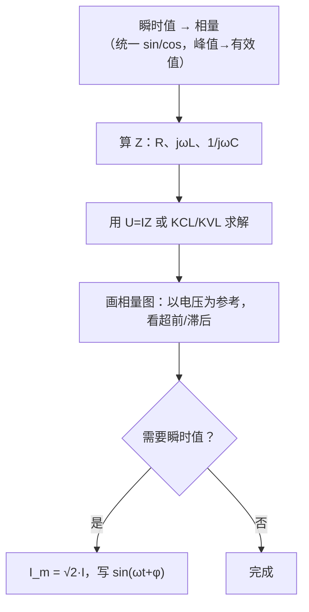

# 交流电路相量分析

> 适用题型：正弦稳态电路——相量运算、R/L/C 阻抗、并联支路分析、功率与储能。

## 目录

- [一、正弦量的三种表示](#一正弦量的三种表示)
- [二、R、L、C 的阻抗与相位](#二rlc-的阻抗与相位)
- [三、基本公式](#三基本公式)
- [四、解题通用流程](#四解题通用流程)
- [例题 2～8 详解](#例题-28-详解)
- [五、考点对照表](#五考点对照表)

---

## 一、正弦量的三种表示

| 形式 | 例子 | 用途 |
|:---:|:---:|---|
| 瞬时值 | 见下方公式 ① | 写波形、求某时刻值 |
| 相量（有效值） | 见下方公式 ② | 计算、画相量图 |
| 复数 | 见下方公式 ③ | 代数运算 |

① 瞬时值：

$$u = U_m\sin(\omega t + \varphi)$$

② 相量（有效值）：

$$\dot{U} = U\angle\varphi$$

③ 复数形式：

$$\dot{U} = U e^{j\varphi}$$

> [!IMPORTANT]
> **换算关系**
>
> $$U_m = \sqrt{2}\,U \qquad \text{（峰值 ↔ 有效值）}$$
>
> 相量用**有效值**，不是峰值。
>
> $$\cos\theta = \sin(\theta + 90^\circ) \qquad \text{（}\sin\text{ 与 }\cos\text{ 相差 }90^\circ\text{）}$$

---

## 二、R、L、C 的阻抗与相位

| 元件 | 阻抗 | 电压相对电流 |
|:---:|:---:|---|
| R | 见公式 ④ | 同相 |
| L | 见公式 ⑤ | 电压超前电流 90° |
| C | 见公式 ⑥ | 电压滞后电流 90°（电流超前电压 90°） |

④ 电阻：

$$Z_R = R, \qquad \varphi = 0^\circ$$

⑤ 电感：

$$Z_L = j\omega L = jX_L$$

⑥ 电容：

$$Z_C = \frac{1}{j\omega C} = -jX_C$$

### 2.1 判断元件类型

看电压、电流相量的相位差：

$$\varphi_Z = \varphi_U - \varphi_I$$

| 相位差 | 元件 |
|:---:|:---:|
| 0° | 电阻 |
| +90° | 电感 |
| -90° | 电容 |

### 2.2 相量图记忆

```
        ↑ Im
        │   ·I_L（电感：I 滞后 U，U 超前）
        │
  ──────┼──────→ Re
        │   ·I_C（电容：I 超前 U）
        │
```

---

## 三、基本公式

| 名称 | 公式编号 |
|---|---|
| 欧姆定律（相量） | ⑦ |
| 并联 KCL | ⑧ |
| 无功功率 | ⑨ |
| 电容储能 | ⑩ |
| 角频率 | ⑪ |

⑦ 欧姆定律（相量）：

$$\dot{U} = \dot{I} \cdot \dot{Z}$$

⑧ 并联 KCL：

$$\dot{I} = \dot{I}_1 + \dot{I}_2 + \cdots$$

⑨ 无功功率（电容取负、电感取正）：

$$Q = UI\sin\varphi$$

⑩ 电容平均储能（U 取有效值）：

$$W_C = \frac{1}{2}CU^2$$

⑪ 角频率：

$$\omega = 2\pi f$$

> [!TIP]
> 复数运算：加减用直角坐标，乘除用极坐标（幅值相乘、角度相加）。

---

## 四、解题通用流程



---

## 例题 2～8 详解

### 例题 2：相量加减乘 → 极坐标

**已知：**

$$\dot{A}_1 = 2\sqrt{3} + j2, \qquad \dot{A}_2 = 2 + j2\sqrt{3}$$

**加法：**

$$\dot{A}_3 = \dot{A}_1 + \dot{A}_2 = (2\sqrt{3}+2) + j(2+2\sqrt{3}) = 2(\sqrt{3}+1)(1+j)$$

实部 = 虚部 → 幅角 45°

$$|\dot{A}_3| = 2(\sqrt{3}+1)\sqrt{2} = 2\sqrt{2}(\sqrt{3}+1)$$

**结果：**

$$\dot{A}_3 = 2\sqrt{2}(\sqrt{3}+1)\,\angle 45^\circ$$

**乘法：**

$$\dot{A}_4 = (2\sqrt{3}+j2)(2+j2\sqrt{3}) = 4\sqrt{3} + j12 + j4 - 4\sqrt{3} = j16$$

**结果：**

$$\dot{A}_4 = 16\angle 90^\circ$$

---

### 例题 3：两个正弦电流相加

**已知：**

$$i_1 = 2\sin(314t + 30^\circ)\ \text{A}$$

$$i_2 = 5\cos(314t + 45^\circ)\ \text{A}$$

**第一步：统一成 sin 形式**

$$i_2 = 5\cos(314t+45^\circ) = 5\sin(314t+135^\circ)$$

**第二步：写相量（有效值）**

$$\dot{I}_1 = \sqrt{2}\angle 30^\circ\ \text{A}, \qquad \dot{I}_2 = \frac{5}{\sqrt{2}}\angle 135^\circ\ \text{A}$$

**第三步：相量相加**

两相量夹角 105°，用平行四边形法则或分量法：

$$|\dot{I}| \approx 3.45\ \text{A}, \qquad \varphi_I \approx 93.6^\circ$$

**结果：**

$$i \approx 4.88\sin(314t + 93.6^\circ)\ \text{A}$$

> [!NOTE]
> 画相量图：I₁ 在 30°，I₂ 在 135°，对角线即总电流 I。

---

### 例题 4：判断元件类型并求参数

**已知：**

$$\dot{U} = 220\angle 120^\circ\ \text{V}, \qquad \dot{I} = 5\angle 30^\circ\ \text{A}, \qquad f = 50\ \text{Hz}$$

**相位差：**

$$\varphi_Z = 120^\circ - 30^\circ = 90^\circ \qquad \text{（电压超前电流 → 纯电感）}$$

**参数：**

$$Z = \frac{220}{5} = 44\ \Omega$$

$$L = \frac{X_L}{\omega} = \frac{44}{100\pi} \approx 140\ \text{mH}$$

---

### 例题 5：电容 i、Q、W_C、相量图

**已知：**

$$C = 10\,\mu\text{F}, \qquad u = 220\sqrt{2}\sin(314t + 60^\circ)\ \text{V}$$

**有效值：**

$$U = 220\ \text{V}, \qquad \omega = 314\ \text{rad/s}$$

**容抗：**

$$X_C = \frac{1}{\omega C} = \frac{1}{314 \times 10 \times 10^{-6}} \approx 318.5\ \Omega$$

**电流（电容：电流超前电压 90°）：**

$$I = \frac{U}{X_C} = \frac{220}{318.5} \approx 0.691\ \text{A}$$

$$i = 0.977\sin(314t + 150^\circ)\ \text{A}$$

**无功功率：**

$$Q = -UI \approx -152\ \text{var}$$

**平均储能：**

$$W_C = \frac{1}{2}CU^2 \approx 0.242\ \text{J}$$

**相量图：** U 在 60°，I 在 150°（超前 90°）。

---

### 例题 6：线圈 R、L（直流 vs 交流）

**直流（只有电阻）：**

$$R = \frac{120}{20} = 6\ \Omega$$

**交流：**

$$U = 220\ \text{V}, \qquad I = 22\ \text{A}, \qquad f = 50\ \text{Hz}$$

$$|Z| = \frac{220}{22} = 10\ \Omega$$

$$X_L = \sqrt{Z^2 - R^2} = \sqrt{100 - 36} = 8\ \Omega$$

$$L = \frac{8}{100\pi} \approx 25.5\ \text{mH}$$

> [!TIP]
> 直流只测 R；交流测的是
>
> $$Z = \sqrt{R^2 + X_L^2}$$
>
> 这是**实际线圈模型**：R 与 L 串联。

---

### 例题 7：并联电路（图 3.8）

**已知：**

$$I_1 = 5\ \text{A}, \qquad I_2 = 5\sqrt{2}\ \text{A}, \qquad U = 220\ \text{V}, \qquad R = X_L$$

**相量关系：**

- 支路 1（纯电容）：I₁ 超前 U 90°
- 支路 2（R 与 X_L 串联，R = X_L）：I₂ 滞后 U 45°

**求参数：**

$$X_C = \frac{U}{I_1} = \frac{220}{5} = 44\ \Omega$$

$$|Z_2| = \frac{U}{I_2} = \frac{220}{5\sqrt{2}} = 22\sqrt{2}\ \Omega$$

$$R = X_L = \frac{|Z_2|}{\sqrt{2}} = 22\ \Omega$$

**总电流（相量相加）：**

I₂ 滞后 45° → 水平分量 5 A，竖直分量 -5 A；加上 I₁ 竖直 5 A：

$$I = 5\ \text{A} \qquad \text{（与电压同相，纯电阻性）}$$

---

### 例题 8：两并联支路（图 3.9）

**已知：**

$$R_1 = R_2 = 10\ \Omega, \qquad L = 31.8\ \text{mH}, \qquad C = 318\ \mu\text{F}, \qquad f = 50\ \text{Hz}, \qquad U = 220\ \text{V}$$

**先算阻抗：**

$$\omega = 100\pi \approx 314\ \text{rad/s}$$

$$X_L = \omega L = 314 \times 0.0318 = 10\ \Omega$$

$$X_C = \frac{1}{\omega C} = \frac{1}{314 \times 318 \times 10^{-6}} \approx 10\ \Omega$$

→ X_L = X_C，结构对称。

**支路阻抗：**

$$Z_1 = 10 + j10 = 10\sqrt{2}\angle 45^\circ\ \Omega$$

$$Z_2 = 10 - j10 = 10\sqrt{2}\angle -45^\circ\ \Omega$$

**支路电流：**

$$I_1 = I_2 = \frac{220}{10\sqrt{2}} = 11\sqrt{2} \approx 15.6\ \text{A}$$

$$\varphi_{I1} = -45^\circ, \qquad \varphi_{I2} = +45^\circ$$

**总电流：**

两电流大小相等、相位差 90°：

$$I = 22\ \text{A}, \qquad \varphi_I = 0^\circ$$

**电容电压：**

$$\dot{U}_C = \dot{I}_2 \cdot (-jX_C) = 110\sqrt{2}\angle -45^\circ\ \text{V}$$

$$U_C \approx 155.6\ \text{V}$$

| 量 | 结果 |
|---|---|
| I₁ | 15.6 A，相位 -45° |
| I₂ | 15.6 A，相位 +45° |
| I | 22 A，与 U 同相 |
| U_C | 155.6 V，相位 -45° |

---

## 五、考点对照表

| 题号 | 核心考点 |
|:---:|---|
| 2 | 复数加减乘、极坐标转换 |
| 3 | sin/cos 统一、相量叠加、相量图 |
| 4 | 由相位差判断元件、求 L/C/R |
| 5 | 电容 i、Q、W_C、相量图 |
| 6 | 实际线圈 R+L 模型（直流/交流对比） |
| 7 | 并联电路、相量图、R=X_L 特殊角 |
| 8 | 完整阻抗分析、对称并联 |

> [!WARNING]
> 常见错误：相量用峰值而非有效值；sin 和 cos 混用未统一；电容电流相位写反（应为电流超前电压 90°）。
