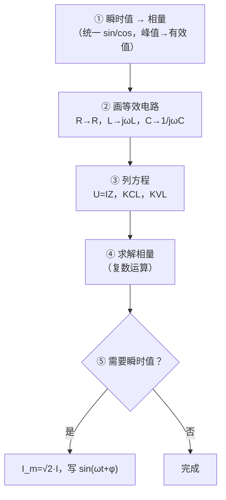

# 交流电路基础与方法

> 适用：正弦稳态交流电路——从基本概念到串联/并联、功率、谐振、三相的**完整方法体系**。
> 配套例题见 [附录：例题 2～8 详解](#附录例题-28-详解)。

## 目录

- [一、正弦交流电基本概念](#一正弦交流电基本概念)
- [二、相量与复数运算](#二相量与复数运算)
- [三、R、L、C 单一元件](#三rlc-单一元件)
- [四、RLC 组合与阻抗化简](#四rlc-组合与阻抗化简)
- [五、正弦稳态分析方法](#五正弦稳态分析方法)
- [六、交流功率](#六交流功率)
- [七、谐振](#七谐振)
- [八、实际元件模型](#八实际元件模型)
- [九、三相交流电路基础](#九三相交流电路基础)
- [十、解题方法总览](#十解题方法总览)
- [附录：例题 2～8 详解](#附录例题-28-详解)

---

## 一、正弦交流电基本概念

### 1.1 正弦量的三要素

正弦电压一般写成：

$$u = U_m\sin(\omega t + \varphi_u)$$

| 要素 | 符号 | 含义 |
|:---:|:---:|---|
| 幅值 | U_m | 最大值（峰值） |
| 角频率 | ω | 变化快慢 |
| 初相 | φ_u | t = 0 时所处的相位 |

电流同理：

$$i = I_m\sin(\omega t + \varphi_i)$$

### 1.2 频率关系

$$T = \frac{1}{f}, \qquad \omega = 2\pi f = \frac{2\pi}{T}$$

常用：f = 50 Hz → ω = 100π ≈ 314 rad/s。

### 1.3 有效值（RMS）

交流电做功能力用**有效值**衡量。对正弦量：

$$U = \frac{U_m}{\sqrt{2}}, \qquad I = \frac{I_m}{\sqrt{2}}$$

反过来：

$$U_m = \sqrt{2}\,U, \qquad I_m = \sqrt{2}\,I$$

> [!IMPORTANT]
> **相量法一律用有效值**，不用峰值。

### 1.4 相位与相位差

**相位差**定义为电压超前电流的角度：

$$\varphi = \varphi_u - \varphi_i$$

| φ | 含义 | 电路性质 |
|:---:|:---:|---|
| φ = 0° | 同相 | 电阻性 |
| φ > 0° | 电压超前 | 感性 |
| φ < 0° | 电压滞后 | 容性 |

---

## 二、相量与复数运算

### 2.1 三种表示形式

| 形式 | 写法 | 何时用 |
|:---:|:---:|---|
| 瞬时值 | u = U_m sin(ωt + φ) | 写波形、求某时刻 |
| 相量 | U∠φ（有效值） | 计算、画相量图 |
| 复数 | U·e^{jφ} | 代数运算 |

相量与瞬时值对应关系（以 sin 为基准）：

$$\dot{U} = U\angle\varphi_u \quad \Longleftrightarrow \quad u = \sqrt{2}\,U\sin(\omega t + \varphi_u)$$

### 2.2 sin 与 cos 统一

做题前必须统一为同一三角函数，推荐全部化为 **sin**：

$$\cos(\omega t + \alpha) = \sin(\omega t + \alpha + 90^\circ)$$

### 2.3 复数运算规则

**加减**——用直角坐标 a + jb：

$$\dot{A} \pm \dot{B} = (a_1 \pm a_2) + j(b_1 \pm b_2)$$

**乘除**——用极坐标 A∠θ：

$$\dot{A} \cdot \dot{B} = A B \angle(\theta_A + \theta_B)$$

$$\frac{\dot{A}}{\dot{B}} = \frac{A}{B}\angle(\theta_A - \theta_B)$$

**直角 ↔ 极坐标转换：**

$$A = \sqrt{a^2 + b^2}, \qquad \theta = \arctan\frac{b}{a}$$

### 2.4 相量图

- 横轴 = 实部（Re），纵轴 = 虚部（Im）
- 同频率正弦量才能画在同一张相量图上
- 通常以**电压为参考**（放在 0° 方向），看电流超前还是滞后
- 多个相量叠加 → 平行四边形（或三角形）法则

```
        ↑ Im
        │     ·U_L（电感：U 超前 I 90°）
        │
  ──────┼────────→ Re
        │  ·U_C（电容：U 滞后 I 90°）
        │
```

---

## 三、R、L、C 单一元件

### 3.1 阻抗与导纳

| 元件 | 阻抗 Z | 导纳 Y = 1/Z | 相位关系 |
|:---:|:---:|:---:|:---:|
| R | R | G = 1/R | U、I 同相 |
| L | jX_L = jωL | -jB_L = -j/(ωL) | U 超前 I 90° |
| C | -jX_C = -j/(ωC) | jB_C = jωC | U 滞后 I 90° |

其中：

$$X_L = \omega L, \qquad X_C = \frac{1}{\omega C}$$

### 3.2 伏安关系（相量形式）

电阻：

$$\dot{U}_R = \dot{I}_R \cdot R$$

电感：

$$\dot{U}_L = jX_L \dot{I}_L$$

电容：

$$\dot{U}_C = -jX_C \dot{I}_C = \frac{\dot{I}_C}{j\omega C}$$

> [!TIP]
> 记忆口诀：**ELI the ICE man** —— 电感 L 中 E（电压）超前 I；电容 C 中 I 超前 E。

### 3.3 由 U、I 相量判断元件

$$\varphi_Z = \varphi_U - \varphi_I$$

| φ_Z | 元件 | 参数求法 |
|:---:|:---:|---|
| 0° | 电阻 | R = U/I |
| +90° | 电感 | X_L = U/I，L = X_L/ω |
| -90° | 电容 | X_C = U/I，C = 1/(ωX_C) |

### 3.4 单一元件的功率与储能

| 元件 | 有功 P | 无功 Q | 储能 |
|:---:|:---:|:---:|---|
| R | UI | 0 | 无 |
| L | 0 | +UI | W_L = ½LI² |
| C | 0 | -UI | W_C = ½CU² |

---

## 四、RLC 组合与阻抗化简

### 4.1 串联阻抗

R、L、C 串联：

$$Z = R + jX_L - jX_C = R + j\left(X_L - X_C\right)$$

模与辐角：

$$|Z| = \sqrt{R^2 + (X_L - X_C)^2}$$

$$\varphi_Z = \arctan\frac{X_L - X_C}{R}$$

### 4.2 并联导纳

R、L、C 并联（**推荐用导纳法**）：

$$Y = G + jB = \frac{1}{R} + j\left(\omega C - \frac{1}{\omega L}\right)$$

等效阻抗：

$$Z = \frac{1}{Y}$$

> [!NOTE]
> 并联电路求总电流时，先算各支路导纳再求和，往往比直接算阻抗更简单。

### 4.3 串并联混合化简

方法与直流电阻电路**完全相同**，只是把 R 换成 Z（复数）：

- 串联：Z_eq = Z₁ + Z₂ + …
- 并联：1/Z_eq = 1/Z₁ + 1/Z₂ + …
- 先化简再代入 U = IZ

### 4.4 常用组合

**RL 串联（实际线圈）：**

$$Z = R + jX_L, \qquad |Z| = \sqrt{R^2 + X_L^2}, \qquad \varphi = \arctan\frac{X_L}{R}$$

**RC 串联：**

$$Z = R - jX_C, \qquad \varphi = \arctan\frac{-X_C}{R}$$

**RL 与 RC 并联（两分支）：**

分别求各支路电流，再用 KCL 相量相加。

---

## 五、正弦稳态分析方法

### 5.1 相量法五步流程



### 5.2 基本定律（相量形式）

**欧姆定律：**

$$\dot{U} = \dot{I} \cdot \dot{Z}$$

**KCL：**

$$\sum \dot{I} = 0 \quad \text{（某节点）}$$

**KVL：**

$$\sum \dot{U} = 0 \quad \text{（某回路）}$$

### 5.3 分压与分流（相量）

串联分压：

$$\dot{U}_k = \dot{U} \cdot \frac{Z_k}{Z_1 + Z_2 + \cdots}$$

并联分流：

$$\dot{I}_k = \dot{I} \cdot \frac{Y_k}{Y_1 + Y_2 + \cdots} = \dot{I} \cdot \frac{1/Z_k}{1/Z_1 + 1/Z_2 + \cdots}$$

### 5.4 两种分析策略

| 策略 | 适用场景 | 核心操作 |
|:---:|---|---|
| 阻抗法 | 串联为主、求总 Z | 化简 Z，用 U = IZ |
| 导纳法 | 并联为主、求总 I | 化简 Y，用 I = UY |
| 支路电流法 | 并联多分支 | 各支路 U 相同，I_k = U/Z_k，再 KCL 相加 |
| 相量图法 | 已知相位关系 | 按比例画相量，几何求合成 |

### 5.5 画相量图解题（并联常用）

1. 以 U 为参考，画在水平轴
2. 纯 R 支路：I 与 U 同相
3. 纯 L 支路：I 滞后 U 90°
4. 纯 C 支路：I 超前 U 90°
5. RL 串联支路：I 滞后 U（角度 = arctan X_L/R）
6. 各支路电流相量相加 → 总电流

---

## 六、交流功率

### 6.1 三种功率

| 名称 | 符号 | 公式 | 单位 |
|:---:|:---:|:---:|:---:|
| 有功功率 | P | P = UI cosφ | W |
| 无功功率 | Q | Q = UI sinφ | var |
| 视在功率 | S | S = UI | VA |

其中 φ 是**同一端口** U 与 I 的相位差（电压超前电流的角度）。

### 6.2 功率三角形

```
        S = UI
       /|
      / |
   Q /  | P = UI cosφ
    / φ |
   /────┘
```

关系式：

$$S = \sqrt{P^2 + Q^2}, \qquad \cos\varphi = \frac{P}{S}, \qquad \sin\varphi = \frac{Q}{S}$$

### 6.3 各元件功率特征

| 元件 | P | Q | 说明 |
|:---:|:---:|:---:|---|
| R | UI | 0 | 消耗有功 |
| L | 0 | +UI | 吸收感性无功 |
| C | 0 | -UI | 发出容性无功 |

### 6.4 功率因数

$$\cos\varphi = \frac{P}{S}$$

- cosφ 越接近 1，设备利用率越高
- 感性负载常用**并联电容**提高功率因数

---

## 七、谐振

### 7.1 串联谐振

RLC 串联，当：

$$X_L = X_C \quad \Longleftrightarrow \quad \omega_0 L = \frac{1}{\omega_0 C}$$

谐振角频率：

$$\omega_0 = \frac{1}{\sqrt{LC}}, \qquad f_0 = \frac{1}{2\pi\sqrt{LC}}$$

**特征：**

- 阻抗最小：Z = R（纯电阻性）
- 电流最大：I₀ = U/R
- U_L 与 U_C 可能远大于 U（电压谐振）

### 7.2 并联谐振

LC 并联（或含 R 的并联组合），当：

$$B_L = B_C \quad \Longleftrightarrow \quad \frac{1}{\omega L} = \omega C$$

**特征：**

- 导纳最小 → 阻抗最大
- 总电流最小（接近纯电阻性）
- 各支路电流可能远大于总电流（电流谐振）

### 7.3 谐振的物理意义

| 类型 | 阻抗 | 电流 | 相位 |
|:---:|:---:|:---:|:---:|
| 串联谐振 | 最小 | 最大 | φ = 0° |
| 并联谐振 | 最大 | 最小 | φ = 0° |

> [!TIP]
> 例题 7 就是并联谐振的典型：I₁（容性）与 I₂（感性）的垂直分量抵消，总电流最小且与 U 同相。

---

## 八、实际元件模型

### 8.1 实际线圈 = R + L 串联

真实电感线圈有内阻，不能当理想电感。

| 测量条件 | 得到什么 |
|---|---|
| 直流 U、I | 只有 R：R = U_dc / I_dc |
| 交流 U、I | 总阻抗：|Z| = U_ac / I_ac |
| 再由 R 分离 | X_L = √(Z² - R²)，L = X_L/ω |

### 8.2 实际电容

高频下需考虑等效串联电阻 ESR，基础题一般仍按理想电容处理。

---

## 九、三相交流电路基础

### 9.1 三相电源

三个幅值相等、频率相同、相位互差 120° 的正弦电源。

### 9.2 Y 形（星形）连接

$$U_{线} = \sqrt{3}\,U_{相}, \qquad I_{线} = I_{相}$$

线电压超前对应相电压 30°。

### 9.3 Δ 形（三角形）连接

$$U_{线} = U_{相}, \qquad I_{线} = \sqrt{3}\,I_{相}$$

### 9.4 三相功率

对称三相：

$$P = \sqrt{3}\,U_{线}I_{线}\cos\varphi$$

$$Q = \sqrt{3}\,U_{线}I_{线}\sin\varphi$$

$$S = \sqrt{3}\,U_{线}I_{线}$$

---

## 十、解题方法总览

### 10.1 题型 → 方法对照

| 题型 | 首选方法 | 关键步骤 |
|:---:|---|---|
| 正弦量相加 | 相量法 | 统一 sin/cos → 写相量 → 相加 |
| 判断 R/L/C | 看 φ = φ_U - φ_I | 0°/±90° 对应三种元件 |
| 求 L、C 参数 | U = IZ | 先算 X，再 ωL 或 1/ωC |
| 串联电路 | 阻抗法 | 化简 Z，分压 |
| 并联电路 | 导纳法 / 相量图 | 各支路 I = U/Z_k，KCL 相加 |
| 实际线圈 | 直流求 R + 交流求 Z | X_L = √(Z²-R²) |
| 功率 | 功率三角形 | 先求 φ，再 P/Q/S |
| 谐振 | X_L = X_C 或 B_L = B_C | 求 ω₀ 或 f₀ |

### 10.2 常见错误

> [!WARNING]
> 1. 相量用峰值而非有效值
> 2. sin 和 cos 混用未统一
> 3. 电容电流相位写反（I 超前 U 90°，不是 U 超前 I）
> 4. 并联电路硬算总 Z 而不拆支路
> 5. 功率公式中 φ 用错（必须是同一端口的 U、I 相位差）

### 10.3 公式速查

**基本：**

$$\omega = 2\pi f, \qquad U = \frac{U_m}{\sqrt{2}}, \qquad \dot{U} = \dot{I}\dot{Z}$$

**元件：**

$$X_L = \omega L, \qquad X_C = \frac{1}{\omega C}$$

**串联：**

$$Z = R + j(X_L - X_C)$$

**功率：**

$$P = UI\cos\varphi, \qquad Q = UI\sin\varphi, \qquad S = UI$$

**谐振：**

$$f_0 = \frac{1}{2\pi\sqrt{LC}}$$

**三相：**

$$P = \sqrt{3}\,U_{线}I_{线}\cos\varphi$$

---

## 附录：例题 2～8 详解

> 以下例题对应教材第 3 章练习，覆盖相量运算、元件识别、功率、线圈模型、并联分析。

### 例题 2：相量加减乘 → 极坐标

**已知：**

$$\dot{A}_1 = 2\sqrt{3} + j2, \qquad \dot{A}_2 = 2 + j2\sqrt{3}$$

**加法：**

$$\dot{A}_3 = \dot{A}_1 + \dot{A}_2 = (2\sqrt{3}+2) + j(2+2\sqrt{3}) = 2(\sqrt{3}+1)(1+j)$$

实部 = 虚部 → 幅角 45°

$$|\dot{A}_3| = 2(\sqrt{3}+1)\sqrt{2} = 2\sqrt{2}(\sqrt{3}+1)$$

**结果：**

$$\dot{A}_3 = 2\sqrt{2}(\sqrt{3}+1)\,\angle 45^\circ$$

**乘法：**

$$\dot{A}_4 = (2\sqrt{3}+j2)(2+j2\sqrt{3}) = j16$$

**结果：**

$$\dot{A}_4 = 16\angle 90^\circ$$

**考点：** 复数加减（直角坐标）、乘除（极坐标）。

---

### 例题 3：两个正弦电流相加

**已知：**

$$i_1 = 2\sin(314t + 30^\circ)\ \text{A}, \qquad i_2 = 5\cos(314t + 45^\circ)\ \text{A}$$

**统一 sin：**

$$i_2 = 5\sin(314t + 135^\circ)$$

**相量：**

$$\dot{I}_1 = \sqrt{2}\angle 30^\circ\ \text{A}, \qquad \dot{I}_2 = \frac{5}{\sqrt{2}}\angle 135^\circ\ \text{A}$$

**相加（夹角 105°）：**

$$|\dot{I}| \approx 3.45\ \text{A}, \qquad \varphi_I \approx 93.6^\circ$$

**结果：**

$$i \approx 4.88\sin(314t + 93.6^\circ)\ \text{A}$$

**考点：** sin/cos 统一、相量叠加、相量图。

---

### 例题 4：判断元件类型并求参数

**已知：**

$$\dot{U} = 220\angle 120^\circ\ \text{V}, \qquad \dot{I} = 5\angle 30^\circ\ \text{A}, \qquad f = 50\ \text{Hz}$$

$$\varphi_Z = 120^\circ - 30^\circ = 90^\circ \qquad \text{→ 纯电感}$$

$$Z = 44\ \Omega, \qquad L = \frac{44}{100\pi} \approx 140\ \text{mH}$$

**考点：** 由相位差判断元件（见 §3.3）。

---

### 例题 5：电容 i、Q、W_C

**已知：** C = 10 μF，u = 220√2 sin(314t + 60°) V

$$X_C \approx 318.5\ \Omega, \qquad I \approx 0.691\ \text{A}$$

$$i = 0.977\sin(314t + 150^\circ)\ \text{A}$$

$$Q \approx -152\ \text{var}, \qquad W_C \approx 0.242\ \text{J}$$

**考点：** 电容 I 超前 U 90°，Q 为负（见 §3.4、§6.3）。

---

### 例题 6：实际线圈 R、L

**直流：** R = 120/20 = 6 Ω

**交流：** |Z| = 220/22 = 10 Ω

$$X_L = 8\ \Omega, \qquad L \approx 25.5\ \text{mH}$$

**考点：** 实际线圈模型（见 §8.1）。

---

### 例题 7：并联电路（图 3.8）

**已知：** I₁ = 5 A，I₂ = 5√2 A，U = 220 V，R = X_L

$$X_C = 44\ \Omega, \qquad R = X_L = 22\ \Omega, \qquad I = 5\ \text{A（与 U 同相）}$$

**考点：** 并联相量图、R = X_L 时 I₂ 滞后 45°、并联谐振（见 §5.5、§7.2）。

---

### 例题 8：两并联支路（图 3.9）

**已知：** R₁ = R₂ = 10 Ω，L = 31.8 mH，C = 318 μF，f = 50 Hz，U = 220 V

X_L = X_C = 10 Ω → 结构对称

$$I_1 = I_2 \approx 15.6\ \text{A}, \qquad I = 22\ \text{A}, \qquad U_C \approx 155.6\ \text{V}$$

**考点：** 完整阻抗分析、对称并联（见 §4.4、§5.4）。

---

### 附录：考点对照

| 题号 | 对应章节 | 核心考点 |
|:---:|---|---|
| 2 | §2.3 | 复数运算 |
| 3 | §2.2、§2.4 | sin/cos 统一、相量叠加 |
| 4 | §3.3 | 相位判断元件 |
| 5 | §3.4、§6.3 | 电容 i、Q、W_C |
| 6 | §8.1 | 实际线圈 R+L |
| 7 | §5.5、§7.2 | 并联相量图、谐振 |
| 8 | §4.4、§5.4 | 完整阻抗分析 |
