# 模拟电子技术 · 背诵速记（完整版）

> 来源：2026南京中心暑期讲义 · 二极管 / 三极管 / 运放 / 反馈  
> 标记：🔴 必考/高频 · 📖 名词解释 · 📐 公式

---

## 第1章 二极管与 PN 结

### 1.1 半导体基础

#### 📖 名词解释

| 概念 | 一句话 |
|---|---|
| 本征半导体 | 完全纯净无杂质的单晶体 |
| 电子空穴对 | 热激发产生的自由电子 + 空穴 |
| 杂质半导体 | 在本征半导体中掺入三价/五价元素 |
| 漂移运动 | 电场力引起的载流子运动 |
| 扩散运动 | 浓度差引起的载流子运动 |
| 正偏 | P 接高电位，N 接低电位 |
| 反偏 | P 接低电位，N 接高电位 |
| 反向击穿 | 反向电压到一定值，反向电流剧增 |

#### 🔴 半导体特性（填空）

| 特性 | 表现 |
|---|---|
| 热敏性 | 温度↑ → 导电能力↑ |
| 光敏性 | 光照 → 导电能力变化 |
| 掺杂性 | 掺杂质 → 导电能力显著改变 |

#### 🔴 N 型 vs P 型

| 类型 | 掺杂 | 多子 | 少子 |
|---|---|---|---|
| N 型 | 五价（如磷） | **电子** | 空穴 |
| P 型 | 三价（如硼） | **空穴** | 电子 |

口诀：**N 电子，P 空穴**

#### 🔴 载流子

- 自由电子带**负**电；空穴带**正**电
- 两者都叫**载流子**

---

### 1.2 PN 结

#### 🔴 单向导电性

| 偏置 | 内/外电场 | 结宽 | 主导 | 结果 |
|---|---|---|---|---|
| 正偏 | 相反 | 变窄 | 扩散 > 漂移 | **导通**（低阻） |
| 反偏 | 相同 | 变宽 | 漂移 > 扩散 | **截止**（高阻） |

- 硅 PN 结正偏导通压降约 **0.7 V**

#### 🔴 击穿类型

| 类型 | 特点 | 可逆？ |
|---|---|---|
| 电击穿 | 雪崩击穿 / 齐纳击穿 | 断电恢复 |
| 热击穿 | PN 结烧毁 | **不可逆** |

📖 **雪崩击穿**：反向电场使电子加速撞击，自由电子数突增

#### 🔴 PN 结电容（填空）

| 电容 | 成因 |
|---|---|
| **势垒电容 Cb** | 反偏时空间电荷区宽窄变化 |
| **扩散电容 Cd** | 正偏时载流子浓度梯度变化 |

---

### 1.3 普通二极管

#### 🔴 伏安特性数值

| 项目 | 硅管 | 锗管 |
|---|---|---|
| 死区电压 | ~0.5 V | ~0.1 V |
| 导通压降 | **0.7 V** | **0.2 V** |

#### 🔴 三种模型

| 模型 | 正偏 | 反偏 |
|---|---|---|
| 理想 | 导线 | 开路 |
| **恒压降**（高频） | 0.7 V 压源 | 开路 |
| 折线 | 折线近似 | 开路 |

#### 🔴 温度影响

- 温度↑ → 反向饱和电流↑ → 正向压降略↓

#### 🔴 应用电路

| 应用 | 原理 |
|---|---|
| **整流** | 交流 → 脉动直流（单向导电） |
| **限幅** | 输出被钳在某电压 |
| **钳位** | 将波形整体平移 |
| **逻辑门** | 二极管开关 |

#### 二极管电路解题步骤

1. **假设 D 断开** → 算两端电压
2. 判正/反偏 → 决定导通/截止
3. 导通 → 用恒压降 0.7 V（硅）代入

---

### 1.4 特殊二极管

| 类型 | 工作区/条件 | 要点 |
|---|---|---|
| **稳压管** | 反向击穿区 | 电流变、电压基本不变；需限流电阻 |
| 发光管 LED | 正偏 | 实操高频 |
| 光电管 | 反偏 | 反向电流 ∝ 照度 |
| 变容管 | **反偏** | 结电容随反偏电压变 |

#### 📐 稳压管参数

$$P_{ZM} = I_{ZM} U_Z, \qquad r_z = \Delta U_Z / \Delta I_Z$$

- 电流太小 → 不稳压
- 电流太大 → 烧管
- 正向：0.7 V；反向：Uz

---

## 第2章 三极管 BJT

### 2.1 结构与放大条件

#### 🔴 三区作用

| 区 | 特点 | 作用 |
|---|---|---|
| 发射区 e | **掺杂最高** | 发射载流子 |
| 基区 b | **最薄**、掺杂最低 | 控制载流子 |
| 集电区 c | **面积最大** | 收集载流子 |

#### 🔴 放大条件

- **内部**：e 多子浓、b 薄、c 面积大
- **外部**：**发射结正偏 + 集电结反偏**（NPN/PNP 相同）

#### 📐 电流关系

$$I_E = I_B + I_C, \qquad I_C \gg I_B, \qquad I_C \approx I_E, \qquad \beta = \frac{\Delta I_C}{\Delta I_B}$$

#### 🔴 电极识别（常考）

- 硅管 BE 压降 ≈ **0.7 V** → 中间电位是 **b 极**
- Ic ≈ Ie >> Ib

---

### 2.2 输出特性三区

| 区 | 偏置 | 特征 | UCE |
|---|---|---|---|
| **放大** | 发射正偏、集电反偏 | Ic = βIb | 较大 |
| **饱和** | 两结正偏 | Ic ≠ βIb | ≈ **0.3 V**（硅） |
| **截止** | 两结反偏 | Ic ≈ 0 | 近 VCC |

- 饱和判据（硅）：UCE < 0.7 V
- 开关：饱和 ≈ 短路；截止 ≈ 开路

#### 🔴 温度影响（了解/判断）

| 参数 | 温度↑ 1°C | 温度↑ 10°C |
|---|---|---|
| UBE | ↓ 2~2.5 mV | — |
| ICBO | — | ↑ 约 1 倍 |
| β | ↑ 0.5~1% | — |

---

### 2.3 失真与通频带

#### 🔴 NPN 共射失真（必背）

| 失真 | 原因 | ic | uCE | 消除 |
|---|---|---|---|---|
| **饱和** | Q 点过高 | 削顶 | 削底 | 减小 IB |
| **截止** | Q 点过低 | 削底 | 削顶 | 增大 IB |

口诀：**共射反相** → ic 与 uCE 波形相反

#### 📐 最大不失真输出

$$U_{om} = \min(U_{CEQ},\ V_{CC} - U_{CEQ}) / \sqrt{2}$$

📖 **通频带**：衡量对不同频率信号的放大能力，越宽适应性越强

---

### 2.4 静态分析

#### 直流通路 / 交流通路

| 通路 | 电容 | 直流源 |
|---|---|---|
| 直流 | **开路** | 保留 |
| 交流 | **短路** | **接地** |

#### 📐 基本共射静态（必背）

$$I_{BQ} = \frac{V_{CC} - U_{BEQ}}{R_b} \approx \frac{V_{CC}}{R_b}$$

$$I_{CQ} = \beta I_{BQ}$$

$$U_{CEQ} = V_{CC} - I_{CQ} R_C$$

- 硅：Ube ≈ 0.7 V；锗：≈ 0.3 V

#### 📐 射极偏置（分压式，更稳定）

$$V_B \approx \frac{R_{b2}}{R_{b1} + R_{b2}} V_{CC}$$

$$I_{CQ} \approx I_{EQ} = \frac{V_B - U_{BEQ}}{R_e}$$

$$U_{CEQ} \approx V_{CC} - I_{CQ}(R_c + R_e)$$

$$I_{BQ} = I_{CQ}/\beta$$

---

### 2.5 三种组态：电路图 + 公式（必背）

答题第一步：**判组态**（看 ui、uo 接 b / e / c 哪个极）

#### 🔴 组态判别表

| 组态 | 输入 | 输出 | 别名 |
|:---:|:---:|:---:|:---:|
| **共射 CE** | b | c | — |
| **共集 CC** | b | e | 射极输出器 |
| **共基 CB** | e | c | — |

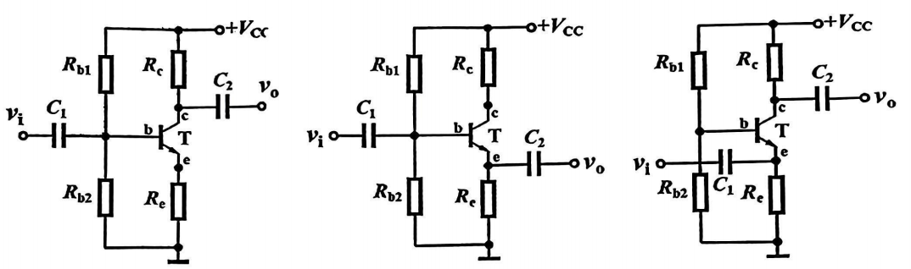

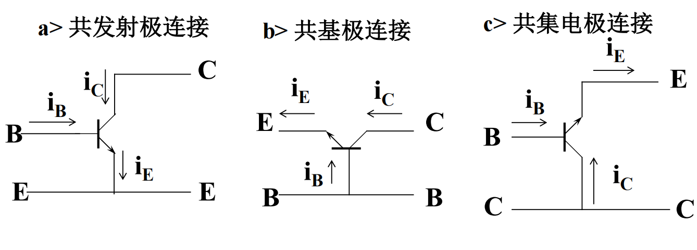

口诀：**输入 b 输出 c→CE，输入 b 输出 e→CC，输入 e 输出 c→CB**

#### 共用预备公式

$$r_{be} \approx 200 + (1+\beta)\frac{26\ \text{mV}}{I_{EQ}\ \text{(mA)}}$$

$$R_L' = R_C \parallel R_L$$

| 通路 | 电容 | 直流源 |
|:---:|:---:|:---:|
| 直流 | 开路 | 保留 |
| 交流 | 短路 | 接地 |

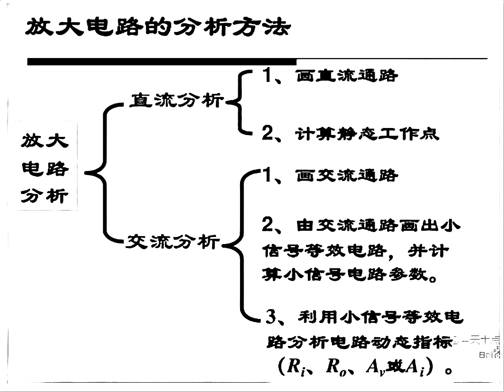

---

#### 共射极 CE

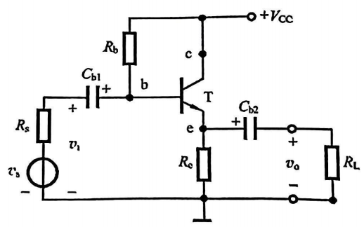

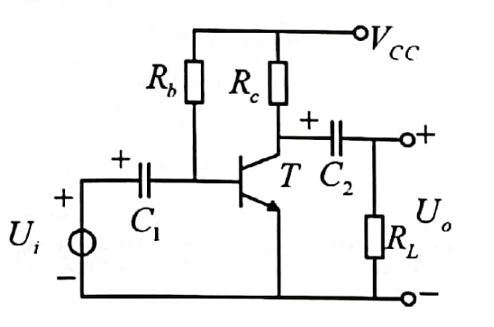

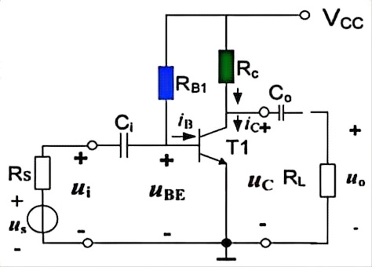

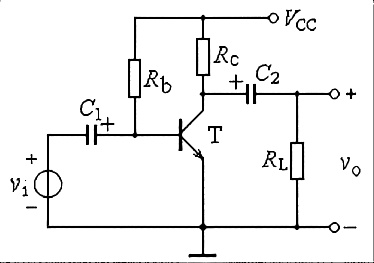

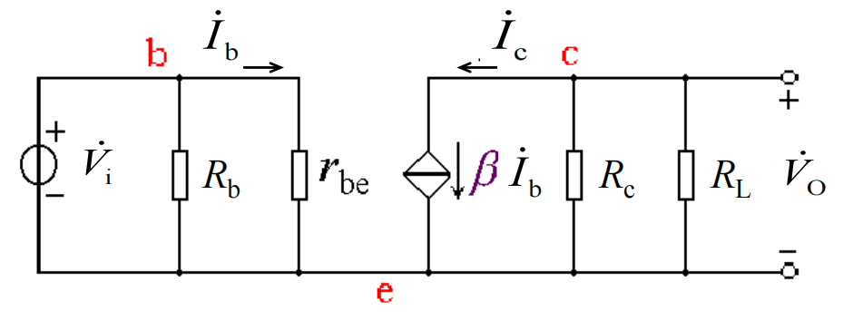

**静态公式：**

$$I_{BQ} = \frac{V_{CC} - U_{BEQ}}{R_B} \approx \frac{V_{CC}}{R_B}, \qquad I_{CQ} = \beta I_{BQ}, \qquad U_{CEQ} = V_{CC} - I_{CQ} R_C$$

**动态公式（无 Re 或 Re 被旁路电容短路）：**

$$A_u = -\frac{\beta R_L'}{r_{be}}, \qquad R_i = R_B \parallel r_{be}, \qquad R_o \approx R_C$$

**有 Re 未旁路（射极偏置负反馈）：**

$$A_u = -\frac{\beta R_L'}{r_{be} + (1+\beta)R_e}$$

$$R_i = R_{B1}\parallel R_{B2}\parallel\left[r_{be}+(1+\beta)R_e\right], \qquad R_o \approx R_C$$

| 特点 | CE |
|---|---|
| Au | 大，**反相**（公式带负号） |
| Ri | 中等 |
| Ro | ≈ Rc |
| 用途 | 一般放大、**中间级** |

---

#### 共集电极 CC（射极输出器）

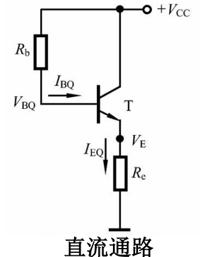

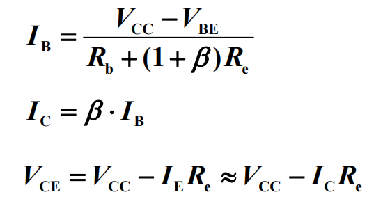

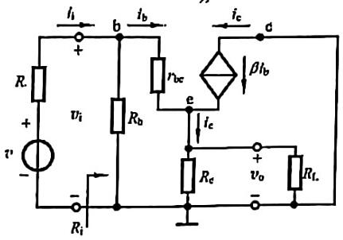

**动态公式：**

$$A_u = \frac{(1+\beta)R_L'}{r_{be}+(1+\beta)R_L'} \approx 1 \quad \text{（同相，电压跟随）}$$

$$R_i = R_B \parallel\left[r_{be}+(1+\beta)R_L'\right] \quad \text{（大）}$$

$$R_o = R_e \parallel \frac{R_s' + r_{be}}{1+\beta} \quad \text{（小）}$$

| 特点 | CC |
|---|---|
| Au | ≈ 1，**同相** |
| Ri | **最大** |
| Ro | **最小** |
| 用途 | 输入级、输出级、**缓冲级** |

口诀：**同相跟随，入大出小**

---

#### 共基极 CB

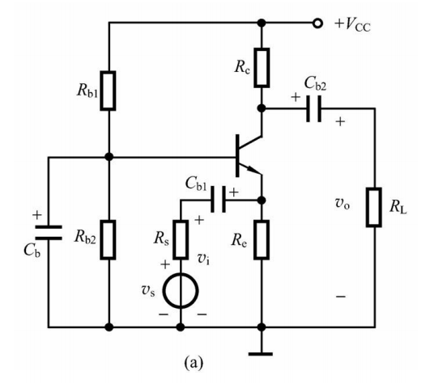

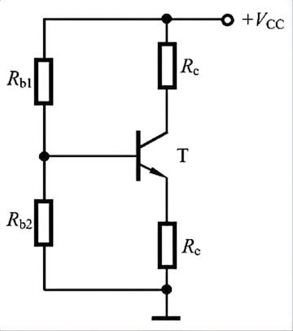

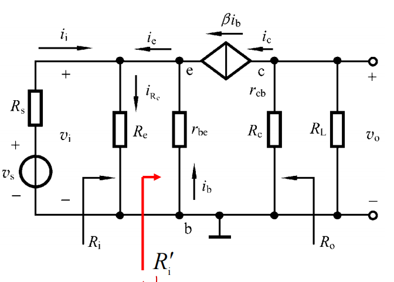

**动态公式：**

$$A_u = +\frac{\beta R_L'}{r_{be}} \quad \text{（同相，无负号）}$$

$$R_i = R_e \parallel \frac{r_{be}}{1+\beta} \approx \frac{r_{be}}{1+\beta} \quad \text{（小）}$$

$$R_o \approx R_C$$

| 特点 | CB |
|---|---|
| Au | 大，同相 |
| Ai | < 1 |
| Ri | **最小** |
| Ro | ≈ Rc |
| 用途 | **高频、宽频带** |

口诀：**同相放电压，入小出中，高频用**

---

#### 三种组态总对比（讲义原图 + 公式）

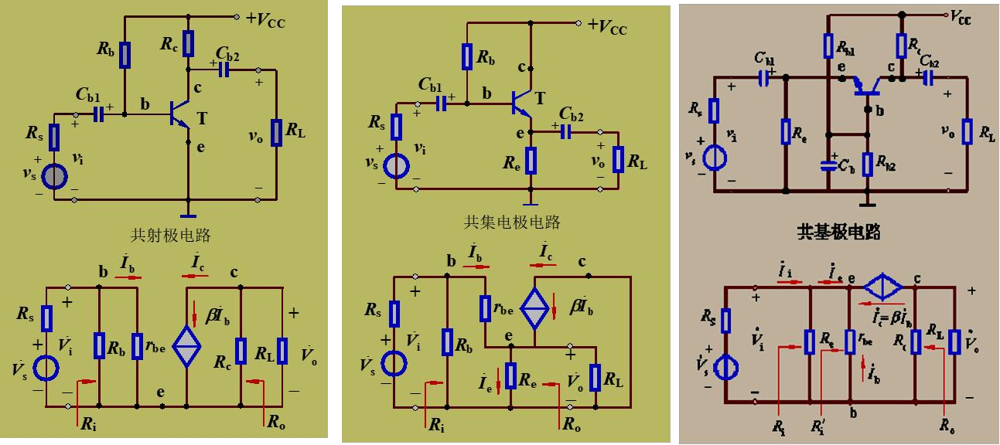

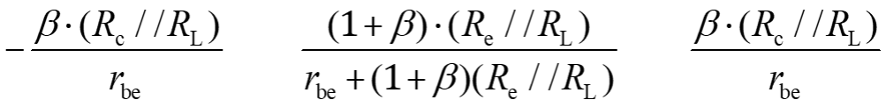

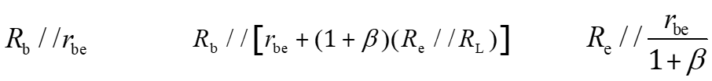

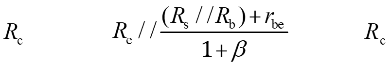

| 组态 | Au | Ri | Ro | 相位 | 用途 |
|:---:|:---:|:---:|:---:|:---:|:---|
| **CE** | −βRL'/rbe | Rb∥rbe | ≈ Rc | **反相** | 中间级 |
| **CE+Re** | −βRL'/(rbe+(1+β)Re) | Rb∥[rbe+(1+β)Re] | ≈ Rc | 反相 | 稳定工作点 |
| **CC** | ≈ 1 | 大 | 小 | 同相 | 缓冲/跟随 |
| **CB** | +βRL'/rbe | ≈ rbe/(1+β) | ≈ Rc | 同相 | 高频 |

> [!WARNING]
> 1. **只有 CE 的 Au 带负号**
> 2. 先求静态 IEQ，再算 rbe
> 3. CC 的 Ri 最大，CB 的 Ri 最小，别搞反

#### 组态大题流程

1. 判组态 → 2. 画直流通路求 IB/IC/UCE → 3. 算 rbe → 4. 画微变等效 → 5. 套 Au/Ri/Ro

---

### 2.6 多级放大与零点漂移

#### 🔴 耦合方式

| 方式 | Q 点 | 频响 | 漂移 | 用途 |
|---|---|---|---|---|
| 阻容耦合 | 独立 | 低频差 | 小 | 一般放大 |
| **直接耦合** | 相互影响 | 好 | **零点漂移** | 集成 |
| 变压器耦合 | 独立 | 差 | 小 | 功率放大 |

📖 **零点漂移**：ui = 0 但 uo ≠ 0；直接耦合特有；用**差分放大**抑制

---

## 第3章 集成运放

### 3.1 理想运放

$$A_{ud}=\infty,\ r_{id}=\infty,\ r_o=0,\ K_{CMR}=\infty$$

非线性区：v+ > v− → vo = +Vom；v+ < v− → vo = −Vom

---

### 3.2 虚短虚断（名词解释必背）

| 名称 | 含义 |
|---|---|
| **虚断** | ri = ∞ → 两输入端电流 ≈ 0 |
| **虚短** | 深度负反馈 → v+ ≈ v− |

---

### 3.3 基本运算电路（公式必背）

#### 同相比例

$$A_v = 1 + \frac{R_2}{R_1}, \qquad R_i \to \infty$$

#### 反相比例

$$A_v = -\frac{R_2}{R_1}, \qquad R_i = R_1$$

#### 电压跟随器

$$A_v \approx 1, \qquad R_o \to 0$$

#### 加法（反相）

$$u_o = -\left(\frac{R_f}{R_1}u_{i1} + \frac{R_f}{R_2}u_{i2} + \cdots\right)$$

#### 减法（差分）

当 R1=R2, Rf=R3：

$$u_o = (u_{i2} - u_{i1})\frac{R_f}{R_1}$$

---

### 3.4 电压比较器

📖 将输入模拟信号与参考电压比较 → **跃变**输出

- 运放**开环**工作
- u+ > u− → 高电平；u+ < u− → 低电平

| 类型 | 输入接法 |
|---|---|
| 同相比较器 | 信号接 + 端 |
| 反相比较器 | 信号接 − 端 |
| 过零比较器 | 参考 = 0 |

#### 📐 单门限阈值

$$U_{TH} = -\frac{R_2}{R_1} U_R \quad (\text{反相结构示例})$$

---

## 第4章 反馈（了解/选择）

📖 **反馈**：输出量的一部分送回输入回路，影响输入输出。

### 🔴 有无反馈判断

1. 找输出 → 找反馈通路 → 是否回到输入
2. 断开反馈通路后，若放大倍数明显变化 → 有反馈

### 🔴 直流/交流反馈

| 类型 | 观察 |
|---|---|
| 直流反馈 | 只通直流的元件（如 RE）→ 稳定静态工作点 |
| 交流反馈 | 只通交流的元件（如旁路电容 Ce）→ 改善动态性能 |

### 🔴 正反馈 vs 负反馈

| 类型 | 效果 |
|---|---|
| 正反馈 | 输出变大；可能振荡 |
| 负反馈 | 输出变小；Av 下降，性能改善 |

### 🔴 四种组态（必背表）

| 反馈类型 | 输入连接 | 输出取样 | 效果 |
|---|---|---|---|
| 电压串联 | 电压求和 | 电压取样 | 稳压、Ri↑ |
| 电压并联 | 电流求和 | 电压取样 | 稳压、Ri↓ |
| 电流串联 | 电压求和 | 电流取样 | 稳流、Ri↑ |
| 电流并联 | 电流求和 | 电流取样 | 稳流、Ri↓ |

### 🔴 负反馈一般表达式

$$
A_f = \frac{A}{1+AF}
$$

F 为反馈系数；1+AF 为反馈深度。

### 🔴 负反馈优缺点

| 优点 | 缺点 |
|---|---|
| 稳定增益 | 增益下降 |
| 展宽频带 | 可能自激振荡 |
| 减小失真 | — |
| 改变 Ri、Ro | — |

### 口诀

| 内容 | 口诀 |
|---|---|
| 电压反馈 | 并联输出取样 |
| 电流反馈 | 串联输出取样 |
| 串联反馈 | 输入电压求和 |
| 并联反馈 | 输入电流求和 |

---

## 模电公式速查墙

```
硅管 VBE=0.7V    锗管 VBE=0.2V
IE=IB+IC         β=ΔIc/ΔIb
IBQ=(Vcc-Ube)/Rb  ICQ=βIBQ  UCEQ=Vcc-IcRc
rbe=200+(1+β)·26/Ie(mA)
rbe=200+(1+β)·26/Ie(mA)
CE: Au=-βRL'/rbe   Ri=Rb//rbe   Ro≈Rc
CC: Au≈1          Ri大        Ro小
CB: Au=+βRL'/rbe  Ri≈rbe/(1+β) Ro≈Rc
Au(同相)=1+R2/R1   Au(反相)=-R2/R1
Pzm=Izm·Uz
```

---

## 模电易混对比

| A | B |
|---|---|
| 正偏 | 导通 |
| 反偏 | 截止 |
| 雪崩击穿 | 可恢复 |
| 热击穿 | 不可逆 |
| 饱和 | UCE≈0.3V，两结正偏 |
| 截止 | 两结反偏 |
| 虚短 | v+≈v− |
| 虚断 | i+=i−=0 |
| 共射 | Au 反相 |
| 共集 | Au≈1，ri 大 |
| 比较器 | 开环，输出跃变 |
| 运算放大 | 负反馈，线性区 |

---

## 模电大题步骤

**静态**：直流通路 → IB → IC → UCE

**动态**：交流通路 → rbe → Au, Ri, Ro

**组态题**：先判 CE/CC/CB → 套对应公式

**运放题**：判同相/反相/加减 → 虚短虚断列方程

**稳压管题**：判 Iz 是否在 Izmin~Izmax 之间
