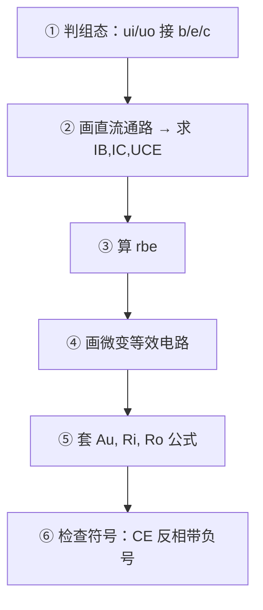

# BJT 放大电路 · 三种组态公式与电路图

> 背诵专用：结构图 → 小信号模型 → Au / Ri / Ro 公式 → 对比表  
> 答题第一步：**判组态**（看 ui、uo 接在哪个极）

---

## 一、组态判别（必背）

| 组态 | 输入 | 输出 | 别名 |
|:---:|:---:|:---:|:---:|
| **共射 CE** | **b** 基极 | **c** 集电极 | — |
| **共集 CC** | **b** 基极 | **e** 发射极 | **射极输出器** |
| **共基 CB** | **e** 发射极 | **c** 集电极 | — |

口诀：**输入输出定组态，公共端同名**

```
         共射 CE              共集 CC              共基 CB
    ui ──→ b                 ui ──→ b             ui ──→ e
    uo ←── c                 uo ←── e             uo ←── c
    公共：e（交流接地）       公共：c               公共：b
```

---

## 二、共用预备公式

### 2.1 小信号参数 rbe

$$r_{be} \approx 200 + (1+\beta)\frac{26\ \text{mV}}{I_{EQ}\ \text{(mA)}}$$

其中 IEQ ≈ ICQ（静态先求出）

### 2.2 负载等效

$$R_L' = R_C \parallel R_L = \frac{R_C \cdot R_L}{R_C + R_L}$$

### 2.3 直流通路 / 交流通路

| 通路 | 耦合/旁路电容 | 直流电源 |
|:---:|:---:|:---:|
| 直流 | **开路** | 保留 |
| 交流 | **短路** | **接地** |

---

## 三、共射极 CE

### 3.1 基本结构图（固定偏置）

```
                    VCC
                     │
                    Rc
                     │
         ui ── C ──┬─┴─┬── uo
                   │   │
                  Rb  │ C
                   │  ┌┴┐ BJT (NPN)
                   │  │ │
                  GND └┬┘
                       │ Re(可无)
                      GND
```

**信号路径**：ui → ib → ic → uo 从 Rc 取出

### 3.2 射极偏置（分压式，更常用）

```
         VCC
          │
         Rc
          │
  ui ─C──┬┴┬── uo
         │  │
        Rb1│ C
         ├─┤ B
        Rb2│ E── Re ── GND
         │  │
        GND └┘
```

### 3.3 静态公式

**基本共射：**

$$I_{BQ} = \frac{V_{CC} - U_{BEQ}}{R_B} \approx \frac{V_{CC}}{R_B}$$

$$I_{CQ} = \beta I_{BQ}, \qquad U_{CEQ} = V_{CC} - I_{CQ} R_C$$

**射极偏置：**

$$V_B \approx \frac{R_{B2}}{R_{B1}+R_{B2}} V_{CC}$$

$$I_{EQ} \approx I_{CQ} = \frac{V_B - U_{BEQ}}{R_e}$$

$$U_{CEQ} \approx V_{CC} - I_{CQ}(R_C + R_e), \qquad I_{BQ} = I_{CQ}/\beta$$

### 3.4 小信号等效电路

```
        ib          ic
  ui ──┬ rbe ──┬── ↓ ── Rc//RL ── uo
       │       │
      GND      GND

  Au = uo/ui = -β(Rc//RL) / rbe   （负号 = 反相）
```

### 3.5 动态公式（必背）

**基本共射（无 Re，或 Re 旁路电容短路）：**

$$A_u = -\frac{\beta R_L'}{r_{be}}$$

$$R_i = R_B \parallel r_{be}$$

$$R_o \approx R_C$$

**射极偏置（Re 未旁路，负反馈）：**

$$A_u = -\frac{\beta R_L'}{r_{be} + (1+\beta)R_e}$$

$$R_i = R_{B1}\parallel R_{B2}\parallel\left[r_{be}+(1+\beta)R_e\right]$$

$$R_o \approx R_C$$

### 3.6 CE 特点

| 项目 | 内容 |
|---|---|
| Au | **大**，**反相**（负号） |
| Ai | 大 |
| Ri | 中等 |
| Ro | ≈ Rc，较大 |
| 用途 | 一般放大、**中间级** |
| 失真 | 饱和削顶/截止削底（ic 与 uCE 反向） |

---

## 四、共集电极 CC（射极输出器）

### 4.1 结构图

```
              VCC
               │
              Rc(可无或很大)
               │
        ui ─C──┤ B
              ┌┴┐
              │ │
         uo ──┤ E ── Re ── GND
              └┬┘
               │
              Rb
               │
              GND
```

**信号从 b 进，从 e 出；c 为交流公共端**

### 4.2 小信号等效电路

```
              (1+β)RL'
  ui ──┬ rbe ──┬───────┬── uo
       │       │       │
      GND      └─ ↓ ib ─┘

  发射极看进去：rbe 与 (1+β)RL' 串联
```

### 4.3 动态公式（必背）

$$A_u = \frac{(1+\beta)R_L'}{r_{be}+(1+\beta)R_L'} \approx 1 \quad \text{（同相，电压跟随）}$$

当 β·RL' ≫ rbe 时，Au → 1

$$R_i = R_B \parallel \left[r_{be}+(1+\beta)R_L'\right] \quad \text{（大）}$$

$$R_o = R_e \parallel \frac{R_s' + r_{be}}{1+\beta} \quad \text{（小）}$$

其中 Rs' 为信号源内阻与 RB 的并联（简化题常忽略）

### 4.4 CC 特点

| 项目 | 内容 |
|---|---|
| Au | **≈ 1**，**同相**（不放大电压，放大电流） |
| Ai | 大（≈ 1+β） |
| Ri | **最大** |
| Ro | **最小** |
| 用途 | **输入级、输出级、缓冲级** |
| 别名 | 射极输出器、电压跟随器 |

口诀：**同相跟随，入大出小**

---

## 五、共基极 CB

### 5.1 结构图

```
         VCC
          │
         Rc
          │
   uo ───┴── C
         ┌┴┐
    ui ──┤ E    B ── 交流接地（偏置网络）
         └┬┘
          │
         Re
          │
         GND
```

**信号从 e 进，从 c 出；b 为交流公共端**

### 5.2 小信号等效电路

```
  ui ── Re ──┬ rbe/(1+β) ──┬── β·ib ── Rc//RL ── uo
             │             │
            GND           GND

  从发射极看入：rbe/(1+β) ≈ 很小
```

### 5.3 动态公式（必背）

$$A_u = \frac{u_o}{u_i} = \frac{\beta R_L'}{r_{be}} \quad \text{（同相，无负号）}$$

$$R_i = R_e \parallel \frac{r_{be}}{1+\beta} \approx \frac{r_{be}}{1+\beta} \quad \text{（小）}$$

$$R_o \approx R_C$$

### 5.4 CB 特点

| 项目 | 内容 |
|---|---|
| Au | 大，**同相** |
| Ai | **< 1**（不放大电流，≈ 1） |
| Ri | **最小** |
| Ro | ≈ Rc |
| 用途 | **高频、宽频带**、恒流源 |
| 频率 | 高频特性最好 |

口诀：**同相放大电压，入小出中，高频用**

---

## 六、三种组态总对比（默写表）

| 组态 | Au | Ai | Ri | Ro | 相位 | 主要用途 |
|:---:|:---:|:---:|:---:|:---:|:---:|:---|
| **CE** | 大（β 级） | 大 | 中 | ≈ Rc | **反相** | 中间级 |
| **CC** | ≈ 1 | 大 | **大** | **小** | 同相 | 输入/输出/缓冲 |
| **CB** | 大（β 级） | < 1 | **小** | ≈ Rc | 同相 | 高频宽带 |

### 公式对照墙

| 组态 | Au | Ri | Ro |
|:---:|:---:|:---:|:---:|
| **CE** | −βRL'/rbe | Rb∥rbe | ≈ Rc |
| **CE+Re** | −βRL'/(rbe+(1+β)Re) | Rb1∥Rb2∥[rbe+(1+β)Re] | ≈ Rc |
| **CC** | (1+β)RL'/(rbe+(1+β)RL') | Rb∥[rbe+(1+β)RL'] | Re∥(Rs'+rbe)/(1+β) |
| **CB** | +βRL'/rbe | Re∥rbe/(1+β) | ≈ Rc |

> CE 公式有**负号**；CC、CB **无负号**（同相）

---

## 七、作图题：直流通路 vs 微变等效

### CE 直流通路

```
VCC ── Rc ── c
              │
         b ── Rb ── VCC (或分压)
              │
         e ── GND (或 Re)
```

### CE 微变等效

```
ui ── rbe ── β·ib ── Rc//RL ── uo
      │
     GND
```

### CC 微变等效

```
ui ── rbe ── (1+β)RL' ── uo
      │         ↑
     GND       ib
```

### CB 微变等效

```
ui ── rbe/(1+β) ── β·ib ── Rc//RL ── uo
```

---

## 八、大题解题流程



### 计算顺序模板

1. 静态：IBQ → ICQ → UCEQ
2. rbe = 200 + (1+β)×26/IEQ(mA)
3. RL' = Rc∥RL
4. 代入对应组态公式
5. CE 写答案时 **Au 带负号**

---

## 九、易错点

> [!WARNING]
> 1. **CE 的 Au 有负号**，CC/CB 没有
> 2. 有 **Re 且未旁路** → 用 CE+Re 公式，Au 变小、Ri 变大
> 3. **CC 的 Au ≈ 1**，不是"不能放大"，而是**电压跟随**
> 4. **CB 的 Ri 很小**，别和 CC 搞反
> 5. 先求静态 **IEQ**，再算 rbe

---

## 十、一页背诵卡

```
判组态：输入b输出c→CE，输入b输出e→CC，输入e输出c→CB

rbe = 200 + (1+β)·26/IEQ(mA)
RL' = Rc//RL

CE:  Au = -βRL'/rbe          Ri = Rb//rbe        Ro ≈ Rc
CC:  Au ≈ 1 (同相)            Ri 大               Ro 小
CB:  Au = +βRL'/rbe (同相)    Ri ≈ rbe/(1+β)     Ro ≈ Rc

CE→反相中间级  CC→跟随缓冲  CB→高频
```
