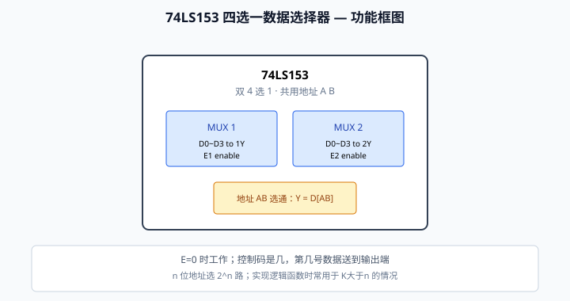

# 数字电子技术 · 背诵速记（完整版）

> 来源：2026南京中心暑期讲义 · 逻辑代数 / 组合 / 时序 / ADC  
> 标记：🔴 必考/高频 · 📖 名词解释 · 📐 公式

---

## 第1章 数字逻辑概论

### 1.1 模拟 vs 数字

| 类型 | 时间 | 数值 | 例子 |
|---|---|---|---|
| 模拟量 | 连续 | 连续 | 温度、压力、正弦波 |
| 数字量 | **离散** | **离散** | 采样→量化→保持→编码 |

### 🔴 正逻辑电平（TTL 典型）

| 电压 | 电平 | 逻辑值 |
|---|---|---|
| 3.5~5 V | H 高 | **1** |
| 0~1.5 V | L 低 | **0** |

注意：0、1 表示逻辑状态，**不是 0 V / 1 V**

---

## 第2章 数制与码制

### 2.1 常见数制

| 数制 | 数码 | 进位 | 基数 |
|---|---|---|---|
| 十进制 | 0~9 | 逢十进一 | 10 |
| 二进制 | 0,1 | 逢二进一 | 2 |
| 八进制 | 0~7 | 逢八进一 | 8 |
| 十六进制 | 0~9,A~F | 逢十六进一 | 16 |

### 🔴 转换方法（必背）

| 转换 | 方法 | 顺序 |
|---|---|---|
| 十→二（整数） | **除 2 取余** | 余数**逆序** |
| 十→二（小数） | **乘 2 取整** | 整数**顺序** |
| 二→十六 | **四位一组**，不足补 0 | 左右分开 |
| 十六→二 | 一位→四位 | — |
| 二→八 | **三位一组**，不足补 0 | 整数从右，小数从左 |

### 🔴 8421 BCD 码（超高频）

- 位权：**8、4、2、1**
- 用 **4 位二进制**表示一位十进制 0~9
- **≠ 普通二进制！**

| 十进制 | 8421 BCD | 普通二进制 |
|:---:|:---:|:---:|
| 6 | **0110** | 110 |
| 75 | **0111 0101** | 1001011 |

- 10~15 在 BCD 中属于**无效码**
- 多位十进制 → 每组 4 位 BCD

### 其他 BCD 码

| 码制 | 位权 | 特点 |
|---|---|---|
| 5421 | 5,4,2,1 | 前 5 码同 8421 |
| 2421 | 2,4,2,1 | 前 5 码同 8421；后 5 自反 |
| **余 3 码** | 无权 | = 8421 + **0011**；自补码 |

例：6 的余 3 码 = 0110 + 0011 = **1001**

### 🔴 格雷码

**任意相邻两位仅差 1 位**（抗干扰）

---

## 第3章 逻辑代数

### 3.1 基本逻辑门口诀

| 门 | 口诀 | 表达式 |
|---|---|---|
| **与** | 有 0 出 0，全 1 出 1 | F = AB |
| **或** | 有 1 出 1，全 0 出 0 | F = A + B |
| **非** | 0↔1 互换 | F = Ā |
| **与非** | 先与后非 | F = AB̄ |
| **或非** | 先或后非 | F = A+B̄ |
| **异或** | **不同为 1** | F = A⊕B = ĀB + A B̄ |
| **同或** | **相同为 1** | F = A⊙B = Ā B̄ + AB |

### 📐 常用恒等式（会默写）

$$A + 0 = A, \quad A \cdot 1 = A$$

$$A + 1 = 1, \quad A \cdot 0 = 0$$

$$A + \overline{A} = 1, \quad A \cdot \overline{A} = 0$$

$$A + A = A, \quad A \cdot A = A$$

$$\overline{\overline{A}} = A$$

$$A + AB = A, \quad A(A+B) = A$$

$$A + \overline{A}B = A + B \quad \text{（吸收，高频）}$$

$$AB + \overline{A}C + BC = AB + \overline{A}C$$

### 🔴 摩根定律

$$\overline{A + B} = \overline{A} \cdot \overline{B}$$

$$\overline{A \cdot B} = \overline{A} + \overline{B}$$

### 反演规则 vs 对偶规则

| 规则 | 运算互换 | 0/1互换 | 变量 |
|---|---|---|---|
| **反演** | · ↔ + | 互换 | **原↔反** → 得 F̄ |
| **对偶** | · ↔ + | 互换 | **不变** → 得 F′ |

优先顺序：**括号 > 与 > 或 > 非**

### 🔴 逻辑函数表示

- n 个输入 → 真值表 **2ⁿ 行**
- 表示方法：表达式、真值表、逻辑图、卡诺图、波形图

### 最简与或式特征

1. 与项（乘积项）**最少**
2. 每项变量数**最少**

---

## 第4章 最小项与化简

### 📖 最小项

- n 变量函数 → **2ⁿ 个**最小项
- 每项含**全部 n 个变量**（原/反各出现一次）

例：3 变量 → ABC, AB C̄, … 共 8 个

$$\overline{A}B = m_1, \quad AB = m_3$$

最小项之和：∑m(1,3,6,7)

### 🔴 最小项性质

1. 仅一组取值使该项 = 1
2. 全体最小项之和 = 1
3. **相邻最小项可合并**，消去 1 个变量

### 卡诺图化简口诀

**圈大圈少，2ⁿ 格，先大后小**

- 相邻格只有 1 位不同
- 无关项 d 可当 0 或 1
- 圈数尽可能少，每圈尽可能大

---

## 第5章 门电路

### 🔴 二极管门 / BJT 开关

| 状态 | 二极管 | BJT |
|---|---|---|
| 导通/饱和 | 正偏 / IB 足够大 | vo ≈ 0.2 V |
| 截止 | 反偏 | vo ≈ VCC |

BJT 饱和条件：IB ≥ VCC / (β Rc)

### TTL / MOS 常识（选择）

| 项目 | 答案/要点 |
|---|---|
| TTL 与非门当非门用 | 多余输入端**接高电平** |
| 线与功能 | **OC 门**（集电极开路） |
| 三态输出 | 高、低、**高阻** |
| 输入输出可互换 | CMOS **传输门** |
| NMOS 导通 | vGS ≥ VT |
| PMOS 导通 | vGS ≤ −VT |
| TTL 输出高电平 | 3.5~5 V |
| TTL 输出低电平 | 0~1.5 V |
| CMOS 功耗 | 静态极低，动态有功耗 |
| 扇出系数 | 门带同类门个数 |

### 🔴 TTL 门电路结构（了解）

- 多发射极输入级 → 与功能
- 中间级 → 放大
- 输出级 → 推拉输出

### 🔴 三态门应用

总线连接：同一时刻仅一个设备驱动总线。

---

## 第6章 组合逻辑

### 📖 组合 vs 时序

| | 组合逻辑 | 时序逻辑 |
|---|---|---|
| 记忆 | **无** | **有** |
| 输出 | 仅看当前输入 | 看输入 + 过去状态 |
| 元件 | 门电路 | 触发器 |
| 反馈 | 无 | 有 |

### 🔴 分析四步

1. 逐级写各门输入输出表达式
2. 化简
3. 列真值表
4. **功能描述**（2022 真题）

### �红 设计五步（大题高频）

1. 逻辑抽象（定义输入输出含义）
2. 列真值表
3. 写表达式 / 画卡诺图
4. 化简
5. 画逻辑图

### 🔴 竞争-冒险

📖 信号变化瞬间，输出可能出现**错误尖峰**

消除：加封锁脉冲、选通脉冲、滤波电容、**修改逻辑设计**

---

## 第7章 常用组合器件

### 编码器

📖 多路信号 → 二进制代码

| 类型 | 特点 |
|---|---|
| 普通编码 | 同一时刻仅 1 个有效 |
| **优先编码** | 多个同时有效 → 编**优先级最高** |

n 个信号 → 至少 **⌈log₂n⌉** 位代码

- **74LS148**：8 线-3 线**优先编码器**（输入**低有效**，编号大者优先）
- **74LS147**：10 线 BCD 优先编码器（了解）


| 类型 | 输入有效 | 多路同时有效 |
|---|---|---|
| 普通编码 | 仅 1 路 | 输出混乱 |
| **优先编码** | 可多路 | 编**优先级最高**（编号最大） |

### 译码器

📖 二进制码 → 特定输出线

- **74LS138**：3 线-8 线，Y0~Y7 = **全部 3 变量最小项**（输出**低有效**）
- 使能：**G1=1**，**G2A=G2B=0** 时才译码
- 可实现 3 变量逻辑函数


| 输入 ABC | 有效输出（低有效） |
|:---:|:---:|
| 000 | Y0 = m0 |
| 001 | Y1 = m1 |
| … | … |
| 111 | Y7 = m7 |

- **74LS42**：BCD-十进制译码，输入 0000~1001 → Y0~Y9（**低有效**）


### 数据选择器 MUX

📖 多路数据 → 一路输出

- **74LS153**：**4 选 1**（一片含**双路** MUX，共用地址 A B）
- **74LS151**：8 选 1；选通端 **Ḡ=0** 工作
- **74LS157**：2 选 1（了解）
- 地址端选 D0~Dn 之一 → 输出 Y
- K 个变量、n 个选择端 → 三种情况（不足/相等/有余）




步骤：表达式 → 最小项 → 变量/数据接选择端

### 全加器

- **半加器**：不考虑低位进位
- **全加器**：考虑低位进位

### 数值比较器 / 七段译码

- **74HC85 / 74LS85**：**四位**数值比较器，输出 A>B、A=B、A<B


| 比较原则 | 说明 |
|---|---|
| 先比高位 | A3 vs B3 不等 → 结果已定 |
| 再看低位 | 高位相等 → 比 A2B2 → A1B1 → A0B0 |
| 级联 | 多片可扩更多位 |

| 芯片 | 配数码管 | 段选电平 |
|---|---|---|
| **74LS47** | **共阳极** | 输出**低有效** |
| **74LS48** | **共阴极** | 输出**高有效** |


📖 BCD 码 DCBA 输入 → 七段 a~g 输出，驱动数码管显示 0~9

---

## 第8章 触发器

### 📖 触发器

- 存 **1 位**二进制
- 两稳态 0/1；原信号消失后**保持新状态**
- 输出取决于：**输入 + 原始状态**（选 C）

### 🔴 特性方程（必须默写）

| 触发器 | 方程 | 约束 |
|---|---|---|
| **D** | Qⁿ⁺¹ = D | — |
| **JK** | Qⁿ⁺¹ = J Q̄ⁿ + K̄ Qⁿ | — |
| **T** | Qⁿ⁺¹ = T Q̄ⁿ + T̄ Qⁿ | 翻转/保持 |
| **SR** | — | **SR = 0**（不能同时为 1） |

### 基本 RS（或非门，高有效）

| S | R | Q |
|:---:|:---:|:---:|
| 0 | 1 | 置 0 |
| 1 | 0 | 置 1 |
| 0 | 0 | 保持 |

### 🔴 同步 RS vs 基本 RS

- **基本 RS**：任何时候都响应
- **同步 RS**：仅 **CP = 1** 时响应

### 🔴 CP 端符号

| 符号 | 触发方式 |
|---|---|
| 无小圆圈 + 三角 | **上升沿** |
| **有小圆圈** + 三角 | **下降沿** |

### 🔴 触发方式对比

| 类型 | CP 作用区间 | 问题 |
|---|---|---|
| **电平触发** | CP = 1 整段 | **空翻**（D 变多次 Q 变多次） |
| **边沿触发** | 仅上升/下降沿瞬间 | 无空翻 |

📖 **空翻**：一个 CP 周期内触发器多次翻转

- 维持阻塞 D 触发器：**上升沿**，克服空翻
- 边沿 D 触发器：常 **下降沿**

### 触发器转换

- D → JK：令 D = J Q̄ⁿ + K̄ Qⁿ
- D → T：令 D = T Q̄ⁿ + T̄ Qⁿ

---

## 第9章 时序逻辑

### 🔴 同步时序分析步骤（大题必背）

1. 写**驱动方程**（各 FF 输入）
2. 代入特性方程 → **状态方程**
3. 列**状态表** / 画**状态图**
4. 画时序图
5. 判断电路功能

### 寄存器 / 移位寄存器

- 1 个 FF 存 1 位 → n 位需 n 个 FF
- **74194**：4 位**双向**移位寄存器（考纲要求）


| S1 S0 | 功能 |
|:---:|:---|
| 00 | 保持 |
| 01 | **右移**（SR 串入） |
| 10 | **左移**（SL 串入） |
| 11 | **并行加载** D0~D3 |

### 计数器

📖 用电路状态表示输入脉冲个数

| 分类 | 类型 |
|---|---|
| 同步/异步 | 所有 FF 同 CP / 逐级触发 |
| 加/减 | 加法、减法、可逆 |
| 进制 | 二/十/任意进制 |

📖 **模 M**：一个循环含 M 个状态

📖 **自启动**：偏离有效序列后能自动回到有效循环（**考试常查**）

填空：模 10 计数器 → **10 个状态**，需 **4 个** FF（2⁴=16≥10）

---

## 第10章 74LS161（2023 真题）

📖 **四位二进制同步加法计数器**——本小节为 2023 年真题最后一道大题考点

### 🔴 功能框图


### 🔴 引脚功能

| 引脚 | 功能 |
|---|---|
| CP | **上升沿**计数 |
| RD̄ | **异步清零**（低有效，立即变 0000） |
| LD̄ | **同步置数**（低有效，CP 上升沿加载 D3D2D1D0） |
| EP, ET | 计数使能（**均为 1** 才计数；级联时高位 ET 接低位 C） |
| C | 进位输出（Q=1111 且 ET=1 时输出，级联用） |
| D0~D3 | 并行数据输入（置数用） |
| Q0~Q3 | 计数输出（QA 为最低位） |

### 🔴 功能表（大题二选一 · 必背）


| RD̄ | LD̄ | EP | ET | CP | 功能 |
|:---:|:---:|:---:|:---:|:---:|:---|
| 0 | × | × | × | × | **异步清零** Q=0000 |
| 1 | 0 | × | × | ↑ | **同步置数** Q=D3D2D1D0 |
| 1 | 1 | 0 | × | × | 保持 |
| 1 | 1 | × | 0 | × | 保持 |
| 1 | 1 | 1 | 1 | ↑ | **计数 +1** |
| 1 | 1 | 1 | 1 | — | 保持（无上升沿） |

### 🔴 构成 M 进制

| 方法 | 原理 | 暂态 |
|---|---|---|
| **清零法** | 第 M+1 状态译码使 RD̄=0 | 第 M+1 态为暂态 |
| **置数法** | 第 M 状态译码使 LD̄=0，预置到初态 | 第 M 态为稳态 |

#### 十进制计数器（M=10）


- **清零法**：计到 **1010**（第 11 态）时 QD·QC·QA=1 → RD̄=0 → 回到 0000；1010 为**暂态**
- **置数法**：计到 **1001**（第 10 态）时译码 → LD̄=0，D 端接 0000 → 下一 CP↑ 加载初态；1001 为**稳态**


#### 级联扩位


- 低位片：EP=ET=1；高位片：EP=1，**ET 接低位 C**
- 两片 → 8 位计数器（模 256）

---

## 第10B章 其他常考计数器

### 74LS193 同步可逆计数器

📖 考纲要求掌握**功能表**；与 161 区别：用 **CPU/CPD** 双时钟控制加/减


| MR | PL | CPU | CPD | 功能 |
|:---:|:---:|:---:|:---:|:---|
| 0 | × | × | × | 异步清零 |
| 1 | 0 | × | × | 同步并行加载 |
| 1 | 1 | ↑ | 1 | **加计数 +1** |
| 1 | 1 | 1 | ↑ | **减计数 -1** |
| 1 | 1 | 1 | 1 | 保持 |

### 74LS290 异步 2-5-10 进制计数器


| 接法 | 进制 |
|---|---|
| 仅 CP0 | **模 2** |
| 仅 CP1 | **模 5** |
| Q0 → CP1 | **模 10**（异步十进制） |

📖 **异步** vs 161 **同步**；R 端低有效异步清零；两片级联可扩更大进制

---

## 第11章 ADC / DAC

### 📖 名词

| 名称 | 含义 |
|---|---|
| DAC | 数字 → 模拟 |
| ADC | 模拟 → 数字 |
| 分辨率 | n 位 → 最多 2ⁿ 个等级 |
| 转换精度 | 实际输出与理论值偏差 |
| 转换速度 | 完成一次转换的时间 |

### 🔴 DAC 要点

- n 位 DAC 最多 **2ⁿ** 个模拟输出等级
- 位数越多，分辨率 **越高**
- 权电阻网络、R-2R 网络（了解）

### 🔴 ADC 四步

**采样 → 保持 → 量化 → 编码**

| 步骤 | 作用 |
|---|---|
| 采样 | 时间上离散化 |
| 保持 | 量化期间保持电压 |
| 量化 | 幅值离散化 |
| 编码 | 转为二进制码 |

### 🔴 采样定理

$$
f_s \geq 2 f_{max}
$$

采样频率 ≥ 2 倍最高频率分量。

### 🔴 常见 ADC 类型（选择）

| 类型 | 特点 |
|---|---|
| 并行比较 | 速度最快，硬件复杂 |
| 逐次逼近 | 速度中等，常用 |
| 双积分 | 精度高，速度慢，抗干扰 |

### 🔴 量化误差

- 量化单位 = 满量程 / 2ⁿ
- 位数不足 → 量化误差大

---

## 数电公式/口诀速查墙

```
与：有0出0，全1出1
或：有1出1，全0出0
异或：不同为1    同或：相同为1
摩根：A+B̄=Ā·B̄   AB̄=Ā+B̄
A+AB=A    A+ĀB=A+B
n变量→2ⁿ行真值表，2ⁿ个最小项
卡诺图：圈大圈少
D: Q+=D
JK: Q+=JQ̄+K̄Q
T: Q+=TQ̄+T̄Q
161: RD̄异步清零，LD̄同步置数
193: CPU加 CPD减  MR清零 PL加载
290: Q0接CP1→模10  异步计数
74194: S1S0 00保持 01右移 10左移 11并行
148: 优先编码 低有效 编号大优先
fs≥2fmax
8421BCD: 6=0110(不是110!)
74LS47→共阳极  74LS48→共阴极
OC门→线与
```

---

## 数电易混对比

| A | B |
|---|---|
| 组合 | 无记忆 |
| 时序 | 有记忆 |
| 编码 | 多→少（代码） |
| 译码 | 少→多（输出线） |
| 异或 | 不同为 1 |
| 同或 | 相同为 1 |
| 反演 | 变量取反 |
| 对偶 | 变量不变 |
| 电平触发 | 可能空翻 |
| 边沿触发 | 无空翻 |
| 清零法 | 用 RD̄ |
| 置数法 | 用 LD̄ |
| 8421 BCD | ≠ 二进制 |
| 共阳极 | 配 74LS47 |

---

## 数电大题流程

**组合分析**：写式 → 化简 → 真值表 → 功能

**组合设计**：抽象 → 真值表 → 化简 → 逻辑图

**时序分析**：驱动方程 → 状态方程 → 状态表/图 → 功能 → 查自启动

**161 改 M 进制**：画状态图 → 选清零/置数 → 连线

**卡诺图**：圈 2ⁿ → 写与或式 → 最简

**触发器波形**：看 CP 边沿 → 代特性方程 → 画 Q
